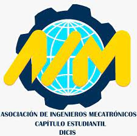

<!-- crear readmi para la instalacion de los paquetes y explicar que hace el proyecto -->
# Proyecto: pagina web para la asosiacion de mecatronicos



## Requisitos
- Node.js
- MySQL
- Git
- GitHub
- NPM
## Instalación:
 - Clonar el repositorio
 - Entrar a la carpeta del proyecto
 - Instalar los paquetes con el siguiente comando:

```bash
npm install
```
## Descripcion:
Este proyecto es una página web para la asociación de mecatrónicos de la universidad de Guanajuato, en la cual se podrá encontrar información sobre la asociación, sus eventos, proyectos, sus miembros, etc. Además de que se podrá contactar con la asociación para solicitar información o para participar en los eventos que se realicen.
### Tecnologias
- HTML
- CSS
- JavaScript
- Node.js
- Express
- MySQL
- Sequelize
- Bootstrap
- Git
- GitHub
- NPM

